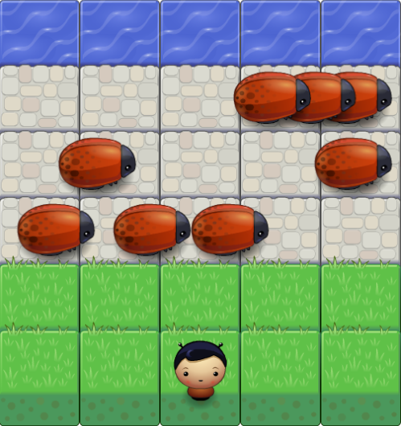

# Arcade Game
  Classic Arcade Game

## Getting Started
  - fork or clone this repo.
  - run it on your local server
  - visit it on your web browser

## Deployment
  Take a look at the live version [https://olumide025.github.io/Arcade-Game/](https://olumide025.github.io/Arcade-Game/)  

## How to play  
  - Load the game as stated above either on your on browser or live version
  - Move your player around with the arrow keys.
  - Your goal is to reach the other end.

## Screenshot

  

## Built With
  - HTML
  - CSS
  - JAVASCRIPT
  - HTML Canvas 

## Prerequisites
  - local server
  - web browser

## Versioning
    Git

## Usage and properties
  - view on any device
  - Responsive

## Author
  Abeeb Ridwan Olumide

## License
  see the [LICENSE.md](LICENSE.md) file for details
